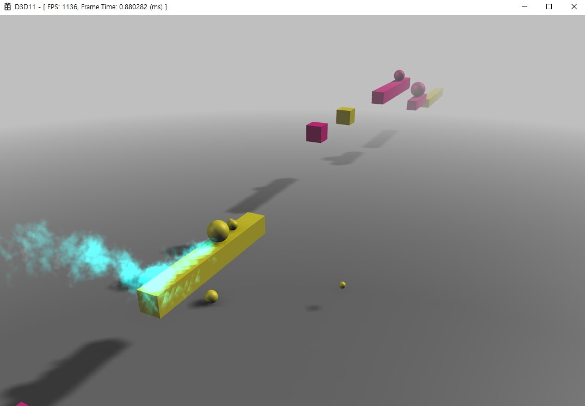
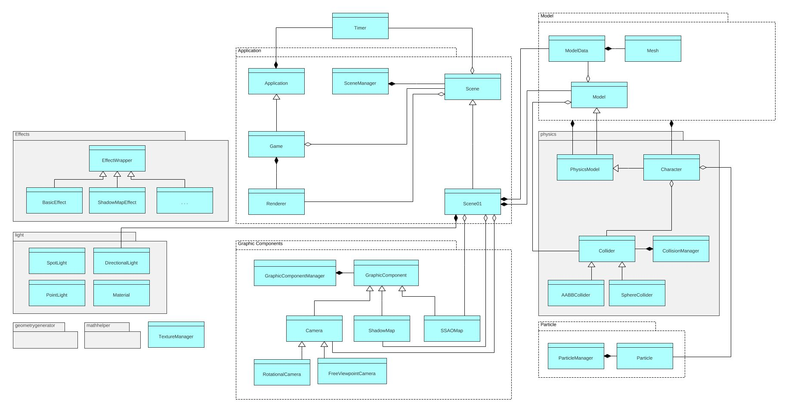

# Chameleon-Run-Imitation

## 설명

'Noodlecake Studio'에서 개발한 모바일 게임 **'Chameleon Run'**의 모작을 목표로 개발하였다.
원작의 게임 규칙과 형태를 모방하였으며, 원작에 등장한 다양한 **그래픽 기술들**과 **충돌**에 의한 상호작용을 구현하는데 집중했다.
특히, 코드의 **재사용성**을 향상시키기 위해 **클래스 관계를 구조화** 하고, 각 클래스들의 **인터페이스를 일치**시켰으며, **상호 의존성**을 낮추기 위해 노력하였다.

## 프로그램 구조

## 주요 기술

* API: **DirectX 11 SDK**
* **HLSL**(High Level Shading Language)을 이용한 GPU 프로그래밍
	* Phong Lighting
	* Fog Effect
	* Shadow Map
	* SSAO(Screen Space Ambient Occlusion) Map with Normal-depth Map
	* Particle Effect
* **충돌**
	* **축 정렬 방식** 사용
		* 맵 전체를 **분할**하여 **인덱스를 할당**하고, 같은 인덱스에 속하는 오브젝트들 간의 충돌 검사 수행
		* 오브젝트 수가 많지 않고, 거리가 떨어져 있기 때문에 사용함
	* Sphere VS. Sphere
	* Sphere VS. AABB(Axis Aligned Bounding Box)
* **리소스 관리**
	* Texture Manager, Graphic Component Manager, Particle Manager 등의 Manager 클래스들

<image src="./ScreenShot/image04.jpg" width="20%"></image> <image src="./ScreenShot/image02.jpg" width="30%"></image> <image src="./ScreenShot/image03.jpg" width="35%"></image>
[Shadow Effect, Normal-depth Map, SSAO Map]

## 참고 자료

* 학부 수업 자료 - 수치해석, 선형대수학, 컴퓨터 그래픽스, 컴퓨터 애니메이션
* 「DirectX 11을 이용한 3D 게임 프로그래밍 입문」 - 프랭크 D. 루나
* 「알기 쉬운 선형대수 개정 11판」 - 김태균 외
* 「Physics for Game Developers」 - 데이비드 버그, 브라이언 비발레츠
	* 충돌 파트
* Unreal Engine 4
* Google C++ Style Guide

## 게임 실행
#### 실행 파일
exe/Chameleon-Run-Imitation.exe

#### 입력
* 게임 시작: 'Enter'
* 점프: 'Space Bar'
* 색 변경: 'A'
* 일시정지/재시작: 'Esc'
* 게임오버/게임 클리어 시 리셋: 'Enter'
* 디버그 스크린: '1'(on/off), '2'(shadow map), '3'(normal-depth map), '4'(ssao map)

#### 규칙

유저가 조종하는 구체(캐릭터)와 같은 색의 물체와 닿으면 2 번의 점프 기회가 주어지며, 다른 색의 물체와 닿으면 게임 오버된다. 맵의 끝에 도달하면 성공이다.
